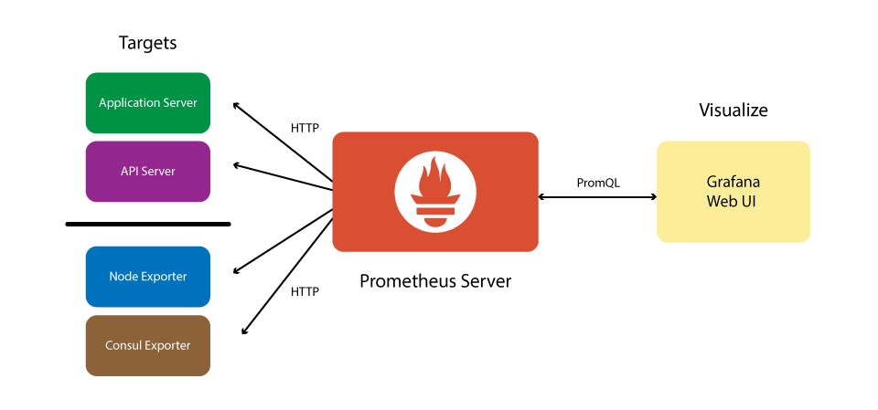

<!-- $theme: default -->

# 
Practical monitoring with Prometheus and Grafana

###### 
Jess Portnoy <jess.portnoy@kaltura.com>, Kaltura, Inc

---

# 
Abstract

 

[Prometheus](https://prometheus.io) is an open source monitoring and alerting toolkit.

In this session we'll review the Prometheus architecture and various tools and walk you through erecting an end-to-end monitoring and alerting infrastructure with the Prometheus stack.

In addition to Prometheus, we'll use:
- [Consul](https://www.consul.io) for automatic service discovery
- [Grafana](https://grafana.com) for data visualisation

 

###### Practical monitoring with Prometheus and Grafana | OSCON 2018
0

---

# 
Session Overview

The session will cover the following topics:

- The Prometheus daemon and metric exporters
- Common metric exporters (MySQL, memcached, Apache, and Nginx)
- Writing custom exporters to instrument your web app's metrics
- Leveraging Consul for auto detection and configuration of services
- Deploying and configuring AlertManager
- Deploying Grafana and generating different graphs and reports

###### Practical monitoring with Prometheus and Grafana | OSCON 2018
1

---

# 
Prometheus - main features

- A multi-dimensional data model with time series data identified by metric name and key/value pairs
- A flexible query language to leverage this dimensionality
- No reliance on distributed storage; single server nodes are autonomous
- Time series collection happens via a pull model over HTTP
- Targets are discovered via service discovery or static configuration
- Pushing time series is supported via an intermediary [gateway](https://github.com/prometheus/pushgateway)
- Multiple modes of graphing and dashboarding support

###### Practical monitoring with Prometheus and Grafana | OSCON 2018
2

---

# 
Prometheus - main components

- The Prometheus server which scrapes and stores time series data
- Special-purpose exporters for services (HAProxy, MySQL, memcached, Apache, etc)
- Client libraries for instrumenting application code
- The Alertmanager
- A push gateway for supporting short-lived jobs (optional)

   

###### Practical monitoring with Prometheus and Grafana | OSCON 2018
3

---

# 
Prometheus - data model

 

Prometheus fundamentally stores all data as [time series](https://en.wikipedia.org/wiki/Time_series): streams of timestamped values belonging to the same metric and the same set of labeled dimensions. 

Besides stored time series, Prometheus may generate temporary derived time series as the result of queries.
     

###### Practical monitoring with Prometheus and Grafana | OSCON 2018
4

---
# 
Architecture overview

  
###### Practical monitoring with Prometheus and Grafana | OSCON 2018
5

---

# 
Prometheus - monitoring

 
In Prometheus terms, the main monitoring service is referred to as the Prometheus Server and the services Prometheus monitors are called targets. 
 
A target can be a host, a network equipment or a specific service.
  
Typically, the Prometheus server/daemon collects metrics from targets by making HTTP[s] requests to the Prometheus exporters. In Prometheus terms, that process is called scarping.

  

###### Practical monitoring with Prometheus and Grafana | OSCON 2018
6

---

# 
Prometheus - exporters

 

An Exporter is a piece of software that fetches metrics from a given system and exports them in a format that the Prometheus server can understand.

There are a number of libraries that can be used to write custom exporters but there are also many existing FOSS exporters, written and maintained by the Prometheus team, third party vendors and community members.

If you need to monitor a popular FOSS system, chances are you'll find an exporter has already been written to get the job done.

###### Practical monitoring with Prometheus and Grafana | OSCON 2018
7

---

# 
Prometheus - monitoring your app

In order to monitor your application, you'll need to write code that retrieves the desired metrics and exports it in a format Prometheus can interpret.
Prometheus offers several official client libraries that can make the task easier:
- Go
- Java or Scala
- Python
- Ruby

Additional third party clients are also available. For a full list, see:
https://prometheus.io/docs/instrumenting/clientlibs/

###### Practical monitoring with Prometheus and Grafana | OSCON 2018
8

---

# 
Consul - service auto discovery

###### Practical monitoring with Prometheus and Grafana | OSCON 2018
9

---
# 
Prometheus - AlertManager

 
The Promtheus Alertmanager handles alerts sent by client applications such as the Prometheus server. 
  
It takes care of de-duplicating, grouping, and routing them to the correct receiver integration such as email, PagerDuty, or OpsGenie. 
  
AlertManager is also capable of silencing and inhibition of alerts.

In this context, inhibition means suppressing notifications for certain alerts if certain other alerts are already firing.

###### Practical monitoring with Prometheus and Grafana | OSCON 2018
10

---

# 
Grafana - reporting and data visualisation

###### Practical monitoring with Prometheus and Grafana | OSCON 2018
11

---
# 
Appendix - Useful Resources

[Prometheus](https://prometheus.io)
[AlertManager](https://prometheus.io/docs/alerting/alertmanager)
[Consul](https://www.consul.io)
[Grafana](https://grafana.com)
[Prometheus exporters](https://prometheus.io/docs/instrumenting/exporters)
[Prometheus client libs](https://prometheus.io/docs/instrumenting/clientlibs)

  

###### Practical monitoring with Prometheus and Grafana | OSCON 2018

---

